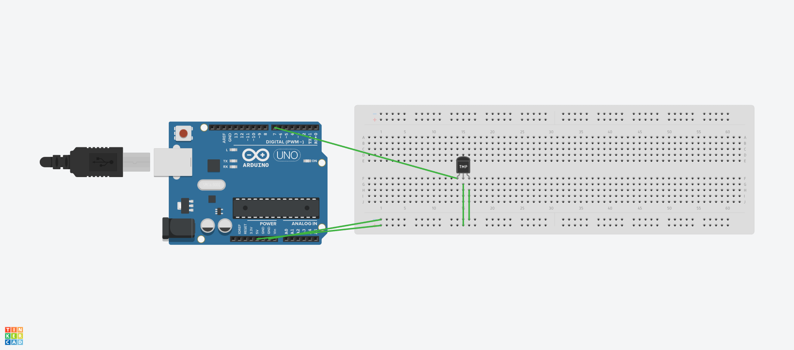

# Temp and Humidity Monitor
## Presenting the Temp in Fahrenheit and Humidity % on the LED Matrix on the face of the Arduino Board

## Required Libraries
- Led Control (Used to interface with LED Matrix)
- Arduino Graphics (Used to simplify LED Matrix API)
- Adafruit Unified Sensor (DHT Sensor Library Dependency)
- DHT Sensor Library (DHT Sensor API)

# Board Diagram
[Tinker Cad](https://www.tinkercad.com/things/jqk6vnZGeEC-funky-jaiks-duup/editel)
